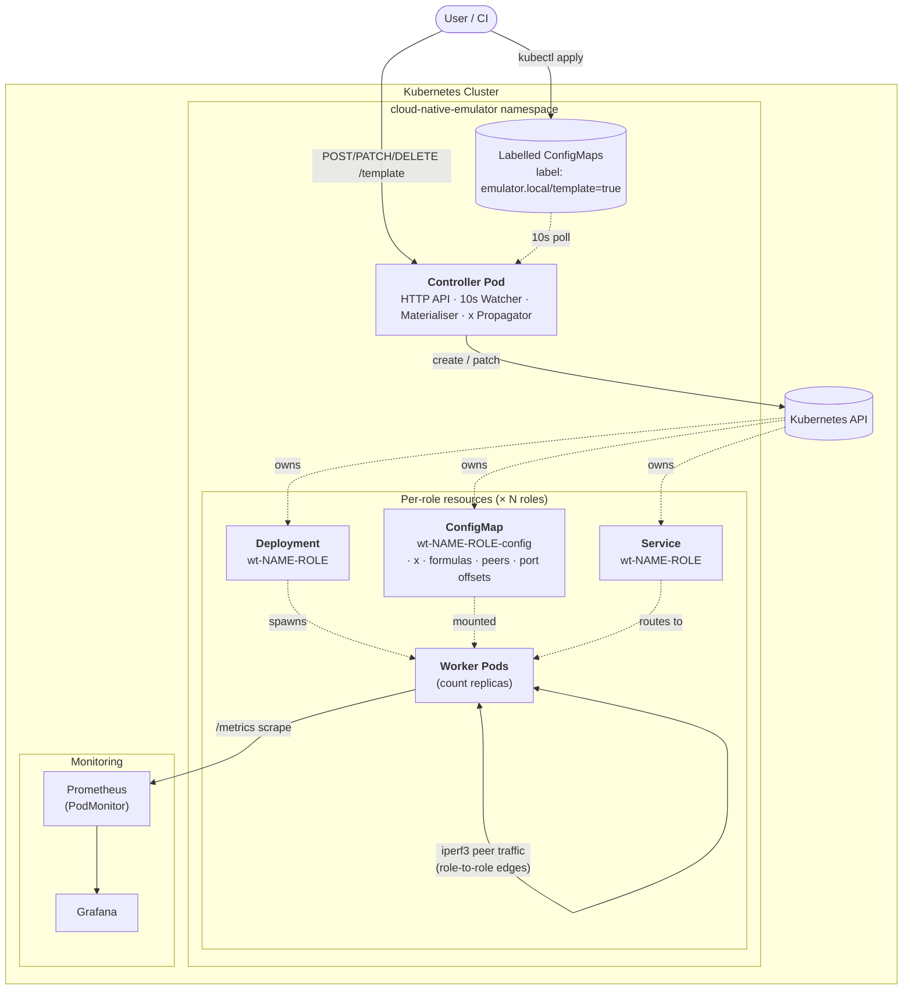
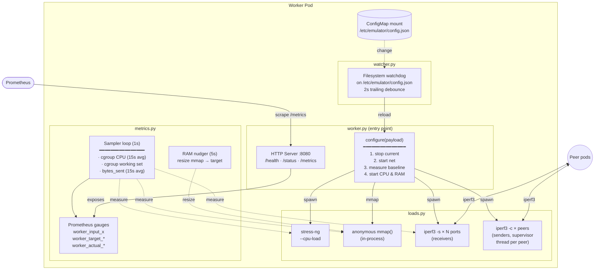
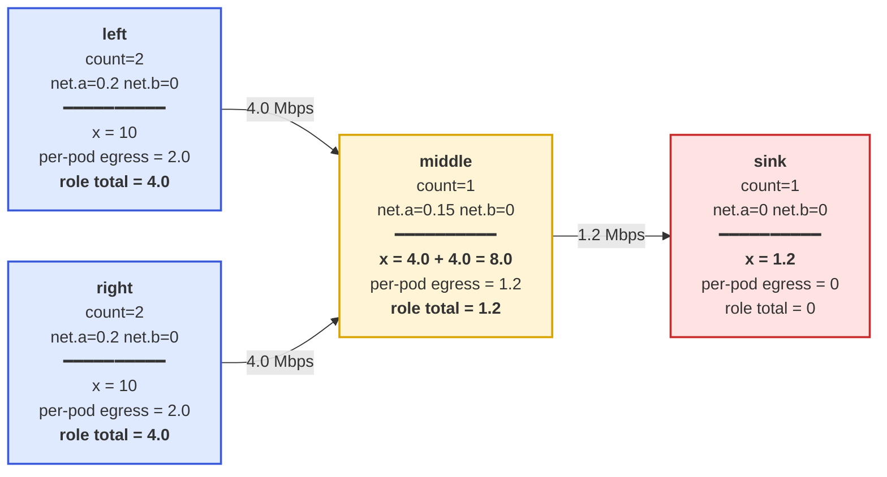
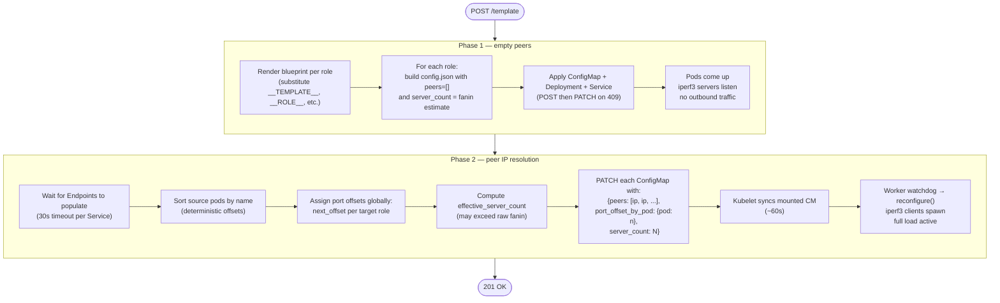
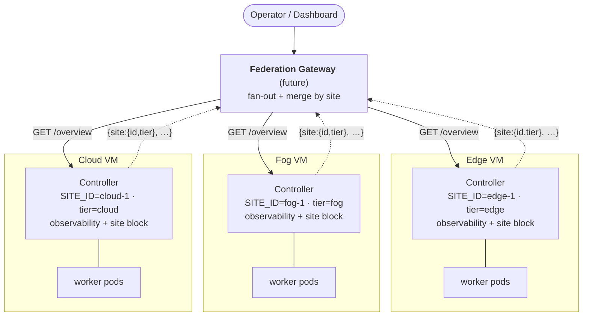

# Architecture Diagrams

Six diagrams that cover the system at progressively finer grain. Each
is provided in both Mermaid (rendered by GitHub, Notion, most IDEs) and
ASCII (paste-anywhere fallback).

1. [System overview](#1-system-overview) — components and who talks to whom
2. [Template lifecycle](#2-template-lifecycle) — what happens on `POST /template`
3. [Worker pod internals](#3-worker-pod-internals) — what's inside a single pod
4. [x propagation](#4-x-propagation) — how the input signal cascades through roles
5. [Two-phase materialisation](#5-two-phase-materialisation) — why deploys take two passes
6. [Site API & federation roadmap](#6-site-api--federation-roadmap) — one VM today, a fleet tomorrow

---

## 1. System overview

The big picture. One controller pod plus N×role-count worker pods, all
in the `cloud-native-emulator` namespace. The controller has two
ingestion paths (HTTP and labelled-ConfigMap watch) that funnel into a
single materialiser.

### Mermaid



### ASCII

```
                    ┌─────────────┐
                    │ User / CI   │
                    └──────┬──────┘
       curl POST/PATCH/    │           kubectl apply
       DELETE /template    │           (labelled CM)
                           ▼
   ┌───────────────────────────────────────────────────────────────┐
   │                                                               │
   │                  ┌──────────────────────────┐                 │
   │                  │     Controller Pod       │                 │
   │                  │  ┌────────────────────┐  │                 │
   │                  │  │ HTTP API (8081)    │  │                 │
   │                  │  │ ConfigMap Watcher  │◀─┼──── 10s poll    │
   │                  │  │ Materialiser       │  │                 │
   │                  │  │ x-Propagator       │  │                 │
   │                  │  └─────────┬──────────┘  │                 │
   │                  └────────────┼─────────────┘                 │
   │                               │                               │
   │                  create/patch │                               │
   │                               ▼                               │
   │                  ┌──────────────────────────┐                 │
   │                  │    Kubernetes API        │                 │
   │                  └────┬─────────┬─────────┬─┘                 │
   │                       │         │         │                   │
   │      Per-role resources (× number of roles)                   │
   │                       ▼         ▼         ▼                   │
   │            ┌──────────┐ ┌──────────┐ ┌──────────┐             │
   │            │ConfigMap │ │Deployment│ │ Service  │             │
   │            └────┬─────┘ └─────┬────┘ └────┬─────┘             │
   │             mount│        spawns│      routes│                │
   │                  ▼             ▼            ▼                 │
   │                  ┌──────────────────────────┐                 │
   │                  │  Worker Pods (×count)    │                 │
   │                  │   stress-ng · mmap ·     │                 │
   │                  │     iperf3 · /metrics    │                 │
   │                  └─────────┬────────────────┘                 │
   │                            │                                  │
   │                  /metrics scrape                              │
   │                            ▼                                  │
   │                  ┌──────────────────────────┐                 │
   │                  │  Prometheus → Grafana    │                 │
   │                  └──────────────────────────┘                 │
   │                                                               │
   │              ◀─── iperf3 peer traffic ───▶                    │
   │           (pod-to-pod, role-to-role edges)                    │
   │                                                               │
   └───────────────────────────────────────────────────────────────┘
                       Kubernetes Cluster
```

---

## 2. Template lifecycle

The sequence of events when a user calls `POST /template`. Highlights
the two-phase materialisation that's central to the design.

### Mermaid

```mermaid
sequenceDiagram
    autonumber
    actor User
    participant Ctrl as Controller
    participant Mat as Materialiser
    participant K8s as Kubernetes API
    participant Pod as Worker Pod(s)

    User->>Ctrl: POST /template {name, x, roles, edges}
    Ctrl->>Mat: validate(template)
    Note over Mat: Schema check<br/>+ cycle detection
    Mat-->>Ctrl: ok (or 400 ValueError)

    Ctrl->>Mat: materialise(template)
    Mat->>Mat: _compute_resolved_x()<br/>(Kahn topological sort)
    Note over Mat: Log: resolved x per role

    rect rgb(235, 245, 255)
        Note over Mat,K8s: Phase 1 — empty peers
        Mat->>K8s: apply ConfigMap, Deployment, Service<br/>(for each role; peers = [])
        K8s-->>Pod: kubelet starts containers
        Pod->>Pod: read config.json → configure()
        Note over Pod: iperf3 servers up<br/>no outbound traffic yet
    end

    rect rgb(245, 255, 235)
        Note over Mat,K8s: Phase 2 — peer IP resolution
        Mat->>K8s: GET Endpoints for each Service
        K8s-->>Mat: pod IPs
        Mat->>Mat: assign global port offsets<br/>compute effective_server_count
        Mat->>K8s: PATCH each ConfigMap<br/>{peers, port_offset_by_pod, server_count}
        K8s-->>Pod: kubelet syncs mounted CM (~60s)
        Pod->>Pod: watchdog → configure() reload
        Note over Pod: iperf3 clients to peer IPs<br/>full load active
    end

    Ctrl-->>User: 201 {name, roles, peers}
```

### ASCII

```
   User              Controller         Materialiser        K8s API         Worker Pods
    │                    │                   │                 │                 │
    │ POST /template     │                   │                 │                 │
    ├───────────────────▶│                   │                 │                 │
    │                    │ validate()        │                 │                 │
    │                    ├──────────────────▶│                 │                 │
    │                    │     schema + cycle detection        │                 │
    │                    │◀──── ok ──────────┤                 │                 │
    │                    │                   │                 │                 │
    │                    │ materialise()     │                 │                 │
    │                    ├──────────────────▶│                 │                 │
    │                    │  ┌────────────────┴──────────┐      │                 │
    │                    │  │ _compute_resolved_x()     │      │                 │
    │                    │  │ topological pass over     │      │                 │
    │                    │  │ role graph                │      │                 │
    │                    │  └────────────────┬──────────┘      │                 │
    │                    │                   │                 │                 │
    │   ┌════════════════╪═══════════════════╪═════════════════╪═════════════╗   │
    │   │ Phase 1 — empty peers              │                 │             │   │
    │   │                │                   │ apply CM/Dep/Svc                  │
    │   │                │                   ├────────────────▶│             │   │
    │   │                │                   │                 │  starts pod │   │
    │   │                │                   │                 ├────────────▶│   │
    │   │                │                   │           pod reads config    │   │
    │   │                │                   │                 │  iperf3     │   │
    │   │                │                   │                 │  servers up │   │
    │   ╚════════════════╪═══════════════════╪═════════════════╪═════════════╝   │
    │                    │                   │                 │                 │
    │   ┌════════════════╪═══════════════════╪═════════════════╪═════════════╗   │
    │   │ Phase 2 — peer IP resolution                                       │   │
    │   │                │                   │ GET Endpoints   │             │   │
    │   │                │                   ├────────────────▶│             │   │
    │   │                │                   │◀── pod IPs ─────┤             │   │
    │   │                │  ┌────────────────┴──────────┐      │             │   │
    │   │                │  │ assign port offsets,      │      │             │   │
    │   │                │  │ compute server_count      │      │             │   │
    │   │                │  └────────────────┬──────────┘      │             │   │
    │   │                │                   │ PATCH each CM   │             │   │
    │   │                │                   ├────────────────▶│             │   │
    │   │                │                   │              CM mounted reload│   │
    │   │                │                   │                 │  watchdog   │   │
    │   │                │                   │                 │  → reload   │   │
    │   │                │                   │                 │ iperf3 cli  │   │
    │   ╚════════════════╪═══════════════════╪═════════════════╪═════════════╝   │
    │                    │                   │                 │                 │
    │                    │◀──── done ────────┤                 │                 │
    │ 201 {name,         │                   │                 │                 │
    │      roles, peers} │                   │                 │                 │
    │◀───────────────────┤                   │                 │                 │
    │                    │                   │                 │                 │
```

---

## 3. Worker pod internals

What's actually running inside a single worker pod. Three load
generators plus a metrics sampler plus a filesystem watcher.

### Mermaid



### ASCII

```
   ┌──────────────────────────────────────────────────────────────────┐
   │                          Worker Pod                              │
   │                                                                  │
   │   ┌────────────────────────────────────────────────────────┐     │
   │   │  ConfigMap mount: /etc/emulator/config.json            │     │
   │   │  { "x": <resolved>, "cpu":{a,b}, "ram":{a,b},          │     │
   │   │    "net":{a,b}, "peers":[...], "port_offset_by_pod"... }     │
   │   └─────────────────────────┬──────────────────────────────┘     │
   │                             │ on change                          │
   │                             ▼                                    │
   │   ┌────────────────────────────────────────────────────────┐     │
   │   │ watcher.py — filesystem watchdog (2s debounce)         │     │
   │   └─────────────────────────┬──────────────────────────────┘     │
   │                             │ calls                              │
   │                             ▼                                    │
   │   ┌────────────────────────────────────────────────────────┐     │
   │   │ configure(payload)                                     │     │
   │   │   1. stop running loads                                │     │
   │   │   2. start network (servers + clients)                 │     │
   │   │   3. sample baseline (1s window)                       │     │
   │   │   4. start CPU + RAM sized for target − baseline       │     │
   │   └─┬───────────────┬──────────────┬─────────────┬─────────┘     │
   │     ▼               ▼              ▼             ▼               │
   │  ┌──────┐      ┌──────┐      ┌─────────┐    ┌─────────┐          │
   │  │stress│      │mmap()│      │iperf3 -s│    │iperf3 -c│          │
   │  │ -ng  │      │      │      │ servers │    │ clients │          │
   │  └──────┘      └──────┘      └──┬──────┘    └────┬────┘          │
   │     ▲              ▲            │                │               │
   │     │              │            └─◀ peers ──▶────┘  (to other    │
   │     │   resize     │                                pods over    │
   │     │              │                                pod network) │
   │     │     ┌────────┴──────────┐                                  │
   │     │     │ RAM nudger (5s)   │                                  │
   │     │     │ resize mmap →     │                                  │
   │     │     │ ram_mb target     │                                  │
   │     │     └────────▲──────────┘                                  │
   │     │              │ reads                                       │
   │     │       ┌──────┴──────────────────────────────────┐          │
   │     └───────┤ Sampler loop (1s) — metrics.py          │          │
   │             │   · cgroup CPU (15s rolling avg)        │          │
   │             │   · cgroup working set (RAM truth)      │          │
   │             │   · bytes_sent (15s rolling avg)        │          │
   │             └──────────────────┬──────────────────────┘          │
   │                                │ sets                            │
   │                                ▼                                 │
   │             ┌──────────────────────────────────────────┐         │
   │             │ Prometheus gauges                        │         │
   │             │  worker_input_x  worker_target_*         │         │
   │             │  worker_actual_*                         │         │
   │             └──────────────────┬──────────────────────┘          │
   │                                │                                 │
   │             ┌──────────────────▼──────────────────────┐          │
   │             │ HTTP Server :8080                       │ ◀── scrape
   │             │  /health · /status · /metrics          │   by Prom │
   │             └─────────────────────────────────────────┘          │
   │                                                                  │
   └──────────────────────────────────────────────────────────────────┘
```

---

## 4. x propagation

How the template's `x` cascades through the role graph. Source roles
use `template.x` directly; downstream roles get the sum of upstream
role-total egress as their own x.

### Mermaid (DAG with annotated x values)

Example: a 4-role topology where two sources feed a middle which
feeds a sink. Numbers shown for `template.x = 10`.



### ASCII

```
                                template.x = 10
                                       │
                ┌──────────────────────┴──────────────────────┐
                │                                             │
                ▼                                             ▼
       ┌────────────────┐                           ┌────────────────┐
       │     left       │                           │     right      │
       │   count = 2    │                           │   count = 2    │
       │ net.a=0.2 b=0  │                           │ net.a=0.2 b=0  │
       │────────────────│                           │────────────────│
       │   x = 10       │                           │   x = 10       │
       │   per-pod: 2.0 │                           │   per-pod: 2.0 │
       │ ROLE TOTAL 4.0 │                           │ ROLE TOTAL 4.0 │
       └────────┬───────┘                           └────────┬───────┘
                │ 4.0 Mbps                                   │ 4.0 Mbps
                └──────────────────────┬─────────────────────┘
                                       ▼
                            ┌────────────────────┐
                            │       middle       │
                            │     count = 1      │
                            │  net.a=0.15 b=0    │
                            │────────────────────│
                            │ x = 4.0 + 4.0      │
                            │   = 8.0  ◀── sum   │
                            │   of inbound       │
                            │ per-pod: 1.2       │
                            │ ROLE TOTAL 1.2     │
                            └─────────┬──────────┘
                                      │ 1.2 Mbps
                                      ▼
                            ┌────────────────────┐
                            │        sink        │
                            │     count = 1      │
                            │  net.a=0 b=0       │
                            │────────────────────│
                            │ x = 1.2            │
                            │ (CPU, RAM scale    │
                            │  with this x)      │
                            └────────────────────┘
```

**Algorithm** (Kahn's topological sort, in `_compute_resolved_x`):

```
1. Build upstream/downstream adjacency from edges (skip self-edges).
2. Queue roles with no upstream → they get template.x.
3. While queue non-empty:
     pop role r
     per-pod egress = max(0, r.net.a * x_r + r.net.b)
     role total     = r.count * per-pod egress
     for each downstream d:
       d.accum += role total
       d.remaining_upstream -= 1
       if d.remaining_upstream == 0:
         x_d = d.accum
         queue.push(d)
4. If any role unresolved → cycle → raise ValueError.
```

---

## 5. Two-phase materialisation

Why deploys can't happen in a single pass: at create time, pods don't
have IPs yet. The materialiser creates everything first, then resolves
peers in a second sweep.

### Mermaid



### ASCII

```
                              POST /template
                                     │
                                     ▼
                          validate (incl. cycles)
                                     │
                                     ▼
                       _compute_resolved_x (Kahn's algo)
                                     │
       ┌═══════════════════════════════════════════════════════════════╗
       │                Phase 1 — empty peers                          ║
       ║                                                               ║
       ║   for each role:                                              ║
       ║     • Render blueprint (substitute placeholders)              ║
       ║     • config.json = { x, cpu, ram, net, peers: [], server_count }
       ║     • Apply CM + Deployment + Service                         ║
       ║                                                               ║
       ║   Pods come up. iperf3 servers listen on 9999..9999+N.        ║
       ║   No outbound traffic yet — peers list is empty.              ║
       ║                                                               ║
       ╚═══════════════════════════════════════════════════════════════╝
                                     │
                                     ▼
                      wait for Endpoints (30s timeout)
                                     │
       ╔═══════════════════════════════════════════════════════════════╗
       ║                Phase 2 — peer IP resolution                   ║
       ║                                                               ║
       ║   • Sort source pods by name (deterministic offsets)          ║
       ║   • Global port-offset counter per target role:               ║
       ║       first source role: offsets 0..count-1                   ║
       ║       next source role: offsets count..count+count2-1         ║
       ║       (no collisions on shared targets)                       ║
       ║   • effective_server_count = max(offset) + 1 per target       ║
       ║                                                               ║
       ║   PATCH each role's CM:                                       ║
       ║     { peers: [<pod_ip>, ...],                                 ║
       ║       port_offset_by_pod: {<pod_name>: <n>},                  ║
       ║       server_count: <effective> }                             ║
       ║                                                               ║
       ║   Kubelet syncs mounted CM (~60s).                            ║
       ║   Worker watchdog fires → configure() reloads.                ║
       ║   iperf3 clients spawn, each connecting to its assigned       ║
       ║   peer:port pair. Full load active.                           ║
       ║                                                               ║
       ╚═══════════════════════════════════════════════════════════════╝
                                     │
                                     ▼
                       Controller returns 201 to caller
```

---

## 6. Site API & federation roadmap

Each controller is the **site API for one VM** and manages one template.
The observability endpoints (`/overview`, `/measurements/*`; see `API.md`)
fuse three data sources behind one envelope — Kubernetes state, live worker
`/metrics` scrapes, and Prometheus time series. Every response is tagged
with a `site` block (`{id, tier}`, from `SITE_ID` / `SITE_TIER` env) and a
generation `timestamp`, so responses are self-describing about *which* part
of the cloud they came from and *when*.

The design goal: one VM today behaves exactly like one node of a fleet
tomorrow. Standing up edge / fog / cloud VMs means deploying the same
image to each with a different `SITE_ID` / `SITE_TIER`. A future
**federation gateway** fans the same observability calls out to every
controller and merges responses by `site` — no schema change on the
controller, because the `site` block is already there.

### Mermaid



### ASCII

```
                       ┌───────────────────────────┐
                       │  Operator / Dashboard      │
                       └──────────────┬─────────────┘
                                      ▼
                       ┌───────────────────────────┐
                       │  Federation Gateway        │  (future)
                       │  fan-out /overview + merge  │
                       │  responses by `site`        │
                       └───┬───────────┬───────────┬┘
              /overview    │           │           │
                          ▼           ▼           ▼
                   ┌──────────┐ ┌──────────┐ ┌──────────┐
                   │ Edge VM  │ │ Fog VM   │ │ Cloud VM │
                   │ ctrl +   │ │ ctrl +   │ │ ctrl +   │
                   │ workers  │ │ workers  │ │ workers  │
                   │ site:    │ │ site:    │ │ site:    │
                   │  edge-1  │ │  fog-1   │ │  cloud-1 │
                   └──────────┘ └──────────┘ └──────────┘
       every response already carries {site:{id,tier}} —
       the gateway merges on it with no controller change.
```

**What exists today vs. what's planned:**

| Piece | Status |
|-------|--------|
| Per-VM observability query (overview + measurements) | **Implemented** |
| `site` block on every response | **Implemented** |
| `SITE_ID` / `SITE_TIER` per controller (env) | **Implemented** |
| Prometheus time-series passthrough (`PROM_URL`) | **Implemented** |
| Federation gateway (fan-out + merge) | Planned |
| Cross-site topology edges (traffic between VMs) | Planned |

---

## Diagram-to-section index

For a presentation, you don't need all five at once. Suggested pairings:

| Slide topic | Use diagram |
|-------------|-------------|
| "What is this system?" (overview) | §1 System overview |
| "How does a template become pods?" | §2 Template lifecycle |
| "What does a worker actually do?" | §3 Worker internals |
| "What's clever about the model?" | §4 x propagation |
| "How are deploys resilient?" | §5 Two-phase materialisation |
| "How does this scale to many VMs?" | §6 Site API & federation roadmap |

The strongest single-slide story is **§1 + §4 side by side**: §1 shows
the parts, §4 shows the model that ties them together.
